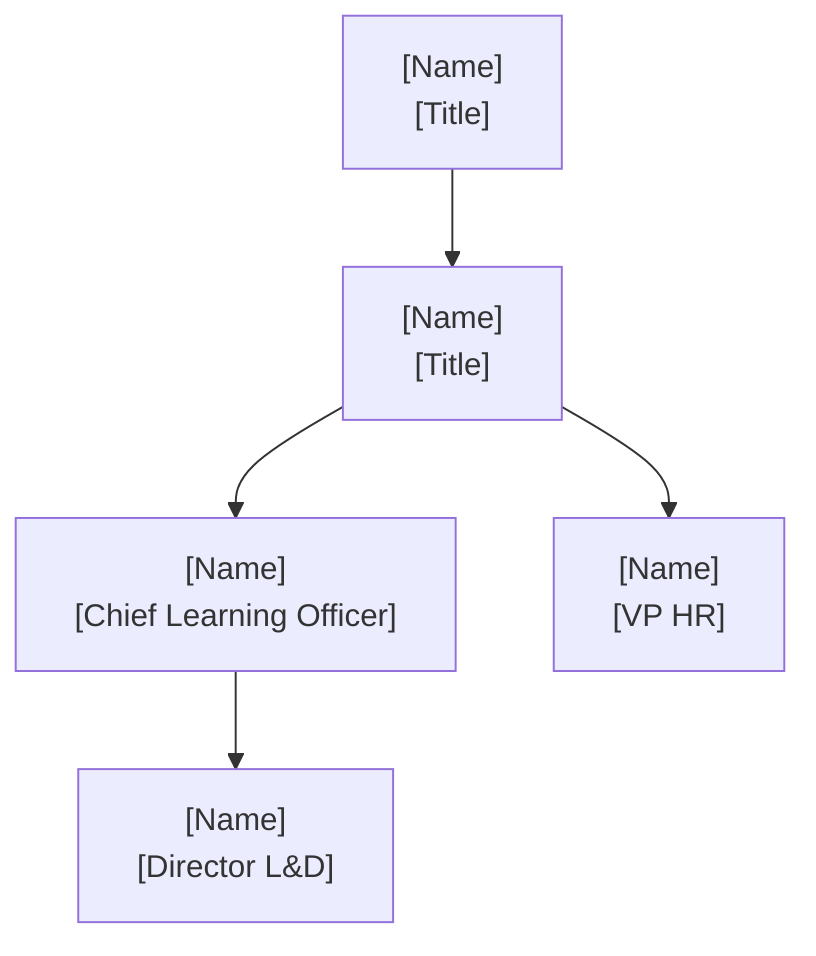

# /sales orgchart — Buying Committee Org Chart Research

Research and render the L&D/HR buying committee org chart for a target account. Invoke as a standalone command (`/sales orgchart <url>`) or as Agent F inside `/sales plan`. Produces a verified contact table, a Mermaid hierarchy diagram, and org structure intelligence — all formatted for direct merge into `content_map.json slide_6.buying_committee`.

## When to Use

- User types `/sales orgchart <url>` — always invoke this skill
- Invoked as Agent F by `/sales plan` Step 4 to enrich buying committee data
- User asks for "org chart", "who are the decision makers", "org structure", or "buying committee map" for a named account
- Existing DECISION-MAKERS.md lacks reporting lines, LinkedIn URLs, or influence mapping

## When NOT to Use

- Full `/sales plan` research is needed — use `/sales plan` instead (this skill is one step)
- Account is a very small company (<500 employees) with no public org information
- User asks for competitor org charts — this skill is for accounts being sold to, not competitors

## Limitations

- LinkedIn scraping is not available — research uses web search results that reference LinkedIn profiles
- Reporting lines are inferred from public sources and may not reflect internal reorg events
- Influence scores are estimates based on role seniority and buying signals, not ground truth
- Job posting signals are a leading indicator only — headcount plans may change

## Invocation syntax

```
/sales orgchart <url> [--deals-folder=<path>] [--account=<slug>]
```

**Examples:**
```
/sales orgchart https://www.appliedmaterials.com
/sales orgchart https://www.appliedmaterials.com --deals-folder="C:/Users/arjaiswa/Desktop/claude-workspace/deals/applied-materials-2026"
```

If `--deals-folder` is provided and `content/DECISION-MAKERS.md` exists there, use it as the seed contact list before enriching with web research.

---

## Step 1 — Seed from DECISION-MAKERS.md (if available)

If `--deals-folder` is provided and `content/DECISION-MAKERS.md` exists, read it. Extract every contact from the **Buying Committee Map** section into a working list with these fields:

| Field | Source |
|-------|--------|
| name | DECISION-MAKERS.md |
| title | DECISION-MAKERS.md |
| role | DECISION-MAKERS.md (Economic Buyer / Champion / etc.) |
| attitude | DECISION-MAKERS.md |
| linkedin_url | DECISION-MAKERS.md if present, else `[RESEARCH]` |
| reports_to | `[RESEARCH]` |
| influence_score | `[RESEARCH]` |
| reason | DECISION-MAKERS.md if present, else `[RESEARCH]` |

If DECISION-MAKERS.md does not exist, start with an empty working list and proceed to Step 2.

---

## Step 2 — Research org structure

If the `exa-search` MCP is available, prefer it for people and company queries — it returns semantically matched results with higher entity precision than keyword search. Use entity-focused queries like `"<Company Name> Chief Learning Officer"` with `type:linkedin_profile` filtering when the tool supports it. Fall back to standard web search with the queries below if unavailable.

Research in this order:

### 2a — Executive leadership layer

First, fetch the company's own leadership page directly — it often surfaces CHRO/CLO names and titles before any LinkedIn search is needed:
- Try: `<url>/about/leadership`, `<url>/leadership`, `<url>/en/about/leadership-team`, `<url>/company/leadership`

Then run targeted searches:
- `"<Company Name>" CHRO OR "Chief People Officer" OR "Chief Learning Officer" site:linkedin.com`
- `"<Company Name>" "VP Learning" OR "VP Talent" OR "EVP Human Resources" OR "VP HR" site:linkedin.com`

Also check recent press releases for C-suite appointment announcements.

Extract name, title, and LinkedIn URL for each relevant executive.

### 2b — L&D and HR division leaders
- `"<Company Name>" "Head of Learning" OR "Director of Learning" OR "Director L&D" OR "Manager Learning" OR "CLO" OR "Head of Talent"`
- `"<Company Name>" "VP HR" OR "CHRO" OR "Chief People Officer" OR "EVP Human Resources"`
- `"<Company Name>" "learning technology" OR "learning experience platform" OR "LMS" OR "LXP" title`

For each person found, record: name, title, who they report to (if stated), LinkedIn URL, and the source URL.

### 2c — IT/Digital leaders (if ALM sale involves IT)
Search: `"<Company Name>" CIO OR "Chief Information Officer" OR "VP IT" OR "VP Digital" OR "CTO"`

### 2d — Reporting line verification

For each executive found:
- `"<full name>" "<company name>" "reports to"` — press releases and org announcements sometimes confirm reporting lines explicitly
- `"<full name>" site:linkedin.com "<company name>"` — LinkedIn About section often states reporting structure
- If exa-search is available, query the person's LinkedIn URL directly for profile content including seniority and manager relationship

### 2e — Leadership change signals
Search: `"<Company Name>" CHRO OR "Chief Learning Officer" OR "VP HR" hired OR appointed OR joins OR named 2024 OR 2025 OR 2026`

Record any new appointments, departures, or role changes in the last 18 months. These are trigger events.

### 2f — Open headcount signals
Search: `"<Company Name>" "Learning" OR "L&D" OR "HR" OR "Talent Development" jobs site:linkedin.com`
Search: `site:<company-domain> jobs "learning" OR "l&d" OR "talent development"`

Record: number of open roles in L&D/HR, seniority level (Director+, Manager, IC), and any patterns (e.g., "building a new LXP team", "hiring 3 instructional designers") that signal investment or pain.

---

## Step 3 — Build the enriched contact table

Merge the seeded contacts (Step 1) with the researched contacts (Step 2). Deduplicate by name. For any contact in DECISION-MAKERS.md not found in web research, keep them but mark `linkedin_url` as `[Not found]`.

**Influence score scale:**
| Score | Meaning |
|-------|---------|
| 5 | Final budget authority / Economic Buyer |
| 4 | Strong champion or primary technical evaluator; can accelerate or kill deal |
| 3 | Active evaluation participant; shapes requirements or reference check |
| 2 | End user or peripheral stakeholder; consulted but not deciding |
| 1 | Potential blocker or unknown — needs qualification |

Produce the enriched contact table in this exact format:

```markdown
## Buying Committee — Enriched Contact Map

| Name | Title | Reports To | Role | Influence | Attitude | LinkedIn | Reason |
|------|-------|-----------|------|-----------|----------|----------|--------|
| [name] | [title] | [manager name or "CEO"] | [Economic Buyer\|Champion\|Technical Evaluator\|End User\|Blocker\|Coach] | [1-5] | [Positive\|Neutral\|Negative\|Unknown] | [URL or Not found] | [1-2 sentences: why this person matters to the deal] |
```

Include up to 12 contacts. Prioritize: Economic Buyer, Champion, Technical Evaluators, then other roles.

---

## Step 4 — Build the Mermaid org chart

Render the org hierarchy as a Mermaid `graph TD` diagram. Use this exact format:

```markdown
## Org Chart — L&D/HR Decision-Making Hierarchy


```

Rules:
- Use uppercase node IDs with no spaces (e.g., `VP_LD`, `DIR_TALENT`)
- Each node label: `"[Full Name]\n[Title]"` — name on line 1, title on line 2
- Solid arrows (`-->`) for direct reporting lines
- Dashed arrows (`-.->`) for strong influence relationships that are not reporting lines (e.g., champion influencing economic buyer)
- If reporting line is inferred (not confirmed), add a comment: `%% Inferred from LinkedIn`
- Limit diagram to the 8 most relevant nodes; omit periphery roles to keep it readable
- If a node is a confirmed Champion, append `:::champion` and add `classDef champion fill:#FA0F00,color:#fff` at the end

---

## Step 5 — Research signals section

Produce three subsections:

### 5a — Leadership change signals
List any CHRO, CLO, VP HR, or VP L&D appointments, departures, or role expansions in the last 18 months. Format:
```
• [Name] named [Title] at [Company] — [Month Year] (Source: [publication])
  → Why it matters: [1 sentence on deal implication — new leader = greenfield opportunity; departure = instability risk]
```

### 5b — Open headcount signals
List open L&D/HR roles found in Step 2f. Format:
```
• [X] open [L&D/HR/Talent] roles as of [date searched]
  → Director-level: [count] | Manager-level: [count] | IC: [count]
  → Signal: [interpretation — e.g., "building new LXP capability", "scaling compliance training team"]
```
If no open roles found, write: `• No open L&D/HR roles found — may indicate budget freeze or fully staffed team.`

### 5c — Org structure notes
2–4 sentences describing:
- How centralized or decentralized is L&D at this company
- Does L&D report to CHRO or directly to a business unit
- Any known shared services model or center of excellence structure
- Implications for an ALM sale (e.g., single contract vs. LOB-by-LOB sale)

---

## Step 6 — Write ORG-CHART.md

Assemble the full output file at:
```
<deals-folder>/content/ORG-CHART.md
```

If `--deals-folder` was not provided, write to the current working directory as `ORG-CHART.md` and tell the user to move it.

File structure:
```markdown
# Org Chart — <Company Name>
_Generated: <YYYY-MM-DD> | Source: Web research + DECISION-MAKERS.md_

## Buying Committee — Enriched Contact Map
[Table from Step 3]

## Org Chart — L&D/HR Decision-Making Hierarchy
[Mermaid diagram from Step 4]

## Intelligence Signals

### Leadership Changes (last 18 months)
[Step 5a content]

### Open Headcount Signals
[Step 5b content]

### Org Structure Notes
[Step 5c content]

## Enriched buying_committee JSON
[JSON block from Step 7]
```

---

## Step 7 — Output enriched buying_committee JSON

At the end of ORG-CHART.md, output a JSON block ready for direct insertion into `content_map.json`. Format it exactly as the `slide_6.buying_committee` schema requires:

```json
"buying_committee": [
  {
    "name": "<full name>",
    "title": "<exact title>",
    "role": "<Economic Buyer|Champion|Technical Evaluator|End User|Blocker|Coach>",
    "reason": "<1-2 sentences: why they matter to the deal>",
    "attitude": "<Positive|Neutral|Negative|Unknown>"
  }
]
```

Include up to 10 contacts. Order by influence score descending (5 first). Do not include `reports_to`, `linkedin_url`, or `influence_score` in this block — those stay in the table above. This block is a drop-in replacement for `slide_6.buying_committee` in `content_map.json`.

Print this instruction after the JSON block:
```
→ To use: replace slide_6.buying_committee in content_map.json with the array above, then re-run Step 6 of /sales plan.
```

---

## Error handling

| Scenario | Action |
|----------|--------|
| DECISION-MAKERS.md not found | Proceed with empty seed list; note in output header |
| No LinkedIn results found for company | Search company website directly; note research limitation in Org Structure Notes |
| Fewer than 3 contacts found total | Output what was found; add `⚠ WARN: fewer than 3 contacts found — manual research recommended` to the header |
| Mermaid diagram has >12 nodes | Trim to the 8 closest to the L&D/HR decision path; note omitted names |
| Contact found but no reporting line confirmed | Set `reports_to` to `[Not confirmed]`; mark inferred lines in Mermaid with `%% Inferred` |
| `--deals-folder` path does not exist | Create `content/` directory; proceed |

---

## Notes

- This skill produces `ORG-CHART.md` only — it does not modify `content_map.json` directly. The AE decides whether to merge the enriched JSON.
- When invoked as Agent F in `/sales plan`, the orchestrator should pass `--deals-folder` so the skill can read DECISION-MAKERS.md as its seed.
- The Mermaid diagram renders natively in GitHub, Obsidian, and most markdown viewers. In PowerPoint it must be screenshot or exported as PNG.
- LinkedIn URLs discovered via web search should be verified — search results sometimes surface stale or incorrect profile links.
